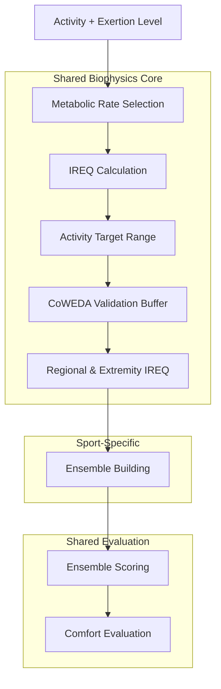
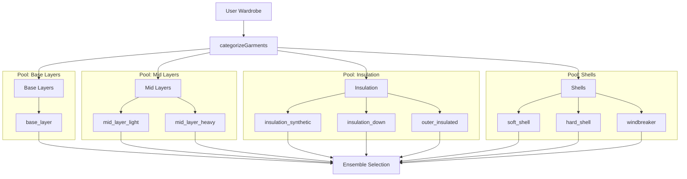
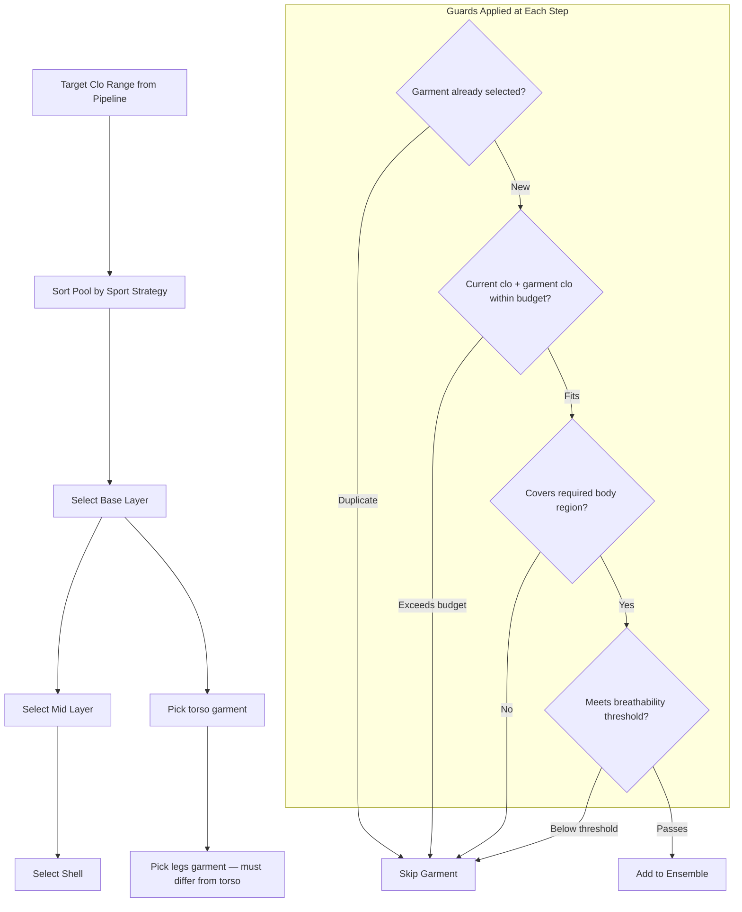
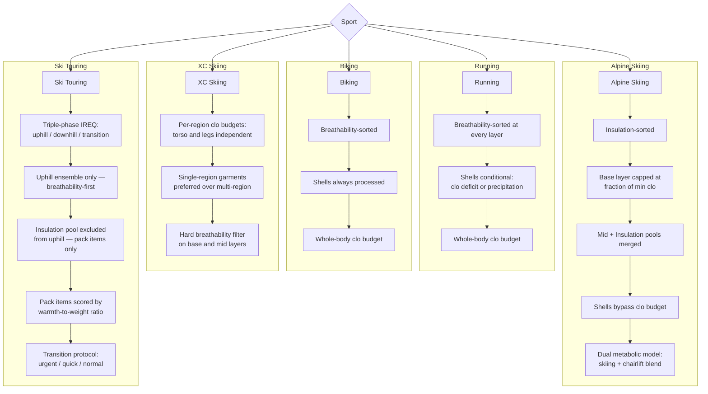
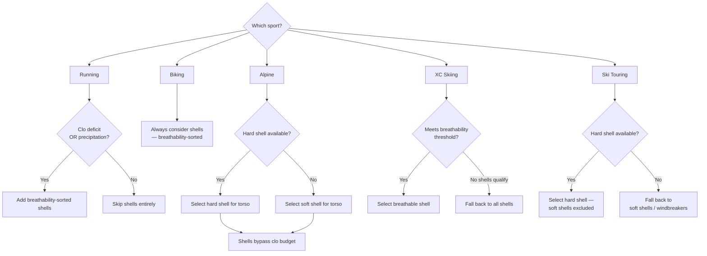
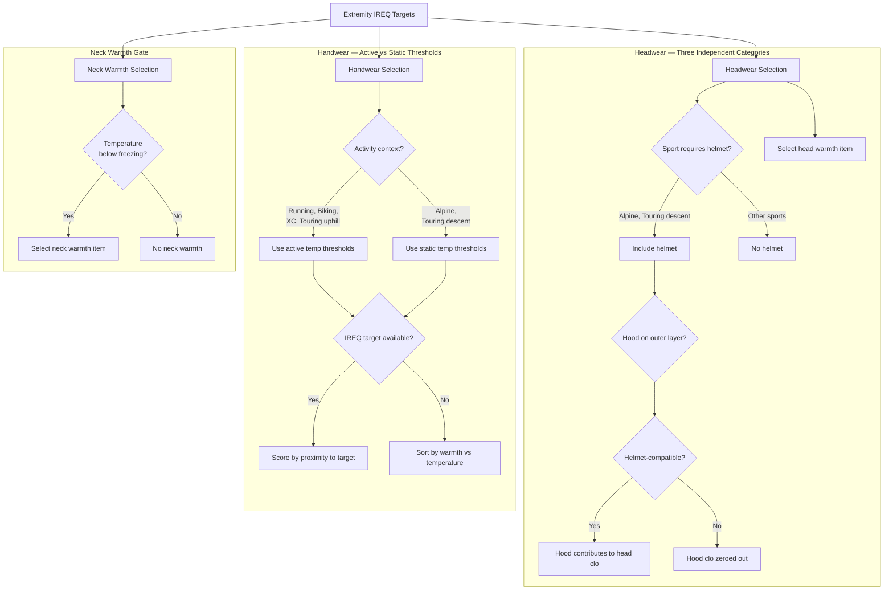

# SWTTR

SWTTR helps you pick the right layers for outdoor activities based on conditions. It blends biophysics-based insulation targets with a gear-aware wardrobe so recommendations are grounded in real clo values.

## Highlights

- **Biophysics-based recommendations** for supported winter sports using IREQ (ISO 11079)
- **Activity-based recommendations** across multiple sports and intensity profiles
- **Manual or forecast mode** for quick input or location/time-based planning
- **Wardrobe management** with calibrated gear data (clo, breathability, wind/water protection)
- **Body-part guidance** (torso, legs, hands, head/neck) with target clo insights
- **Backpack planning** for activity + temperature range
- **Mobile-first UX** with a Gear Up FAB and bottom navigation

## Activities

- Alpine Skiing
- Backcountry Skiing
- XC Skiing
- Hiking / Snowshoeing
- Running
- Biking

**Biophysics support:** Alpine Skiing, Backcountry Skiing, and XC Skiing. Other activities use static recommendations from `src/data/layerRecommendations.json`.

## How Layer Recommendations Work

The biophysics-supported activities share a common recommendation pipeline built on the IREQ standard (ISO 11079). The diagrams below describe the architecture for contributors. All calculations live server-side under `src/lib/biophysics/` and sport-specific route handlers under `src/app/api/v1/recommendations/`.

### 1. Recommendation Pipeline

Every biophysics recommendation passes through the same eight-step pipeline, from metabolic rate lookup through final comfort classification.



### 2. Garment Categorization and Pool Structure

Before ensemble building begins, all wardrobe garments are split into four mutually exclusive pools based on their category. Each garment belongs to exactly one pool.



### 3. Ensemble Building Flow

Garments are selected in a fixed order: base layers first, then mid layers, then shells. A running clo budget prevents over-insulation, and duplicate prevention ensures no garment appears twice.



### 4. Sport Ensemble Variants

While all sports follow the same general selection order, each has architectural differences in sorting strategy, budget model, and layer handling.



### 5. Shell Exclusion Rules

Shell selection varies significantly by sport. This decision tree shows when and which shells are considered.



### 6. Extremity Selection

Extremity recommendations handle headwear, handwear, and neck warmth with distinct selection logic and sport-dependent context.



## Getting Started

### Prerequisites

- Node.js 18+
- npm, yarn, pnpm, or bun

### Install

```bash
npm install
```

### Environment Variables

Create a `.env.local` file with the following optional variables:

```bash
# Supabase (optional - enables persistent wardrobe and calibrated gear data)
NEXT_PUBLIC_SUPABASE_URL=your_supabase_url
NEXT_PUBLIC_SUPABASE_ANON_KEY=your_supabase_anon_key
```

Without Supabase configured, the app uses static layer recommendations from `src/data/layerRecommendations.json`.

### Development

```bash
npm run dev
```

Open `http://localhost:3000` in your browser.

### Build

```bash
npm run build
```

### Lint

```bash
npm run lint
```

## Testing

This project uses Vitest with React Testing Library.

```bash
# Run all tests (watch mode by default in dev)
npm test

# Run tests with UI
npm run test:ui

# Run tests with coverage
npm run test:coverage
```

## Project Structure

```
src/
  app/                          # Next.js App Router pages
    api/                        # API routes (weather, wardrobe, recommendations)
    backpack/                   # Backpack management page
    faq/                        # FAQ page
    wardrobe/                   # My Gear page
    page.tsx                    # Home page
  components/
    icons/                      # Custom SVG icons
    wardrobe/                   # Wardrobe components
    ui/                         # Shared UI components (shadcn/ui)
    ActivitySelection.tsx       # Activity carousel
    BackpackEditor.tsx          # Pack list editor
    BiophysicsDetails.tsx       # Thermal comfort details
    LayerDisplay.tsx            # Recommendation display
    PreferencesDrawer.tsx       # User preferences
    WeatherSelection.tsx        # Temperature/wind sliders
  data/
    activities.ts               # Activity definitions
    layerRecommendations.json   # Default layer recommendations
    layerOptions.ts             # Available layer options
  hooks/
    useBackpack.ts              # Backpack state management
    useBiophysicsRecommendation.ts  # IREQ-based recommendations
    useCurrentWeather.ts        # Weather data hook
    useItemMappings.ts          # Gear mappings hook
    useLocationSearch.ts        # Location search hook
    usePreferences.ts           # User preferences hook
  lib/
    biophysics/                 # IREQ thermal comfort calculations
    recommendations/            # Shared recommendation logic
    supabase.ts                 # Supabase client
  types/
    biophysics.ts               # Thermal property types
    garments.ts                 # Garment database types
    wardrobe.ts                 # Wardrobe types
```

## Database (Supabase)

The app uses a biophysics-based garment database with calibrated thermal properties. See `supabase/migrations/` for the full schema. Key tables:

- `garments` - Clothing items with brand, model, category, and body coverage
- `garment_thermal_properties` - Rcl (thermal resistance) and Recl (evaporative resistance)
- `garment_protection` - Wind and water resistance ratings
- `garment_activity_ratings` - Activity-specific suitability scores
- `handwear` / `headwear` - Extremity items with thermal properties
- `user_wardrobe` - Links users to their owned gear

## Deployment

The app is hosted at `swttr.vercel.app`.

Deploy your own instance with Vercel:

[](https://vercel.com/new/clone?repository-url=https://github.com/yourusername/swttr)
