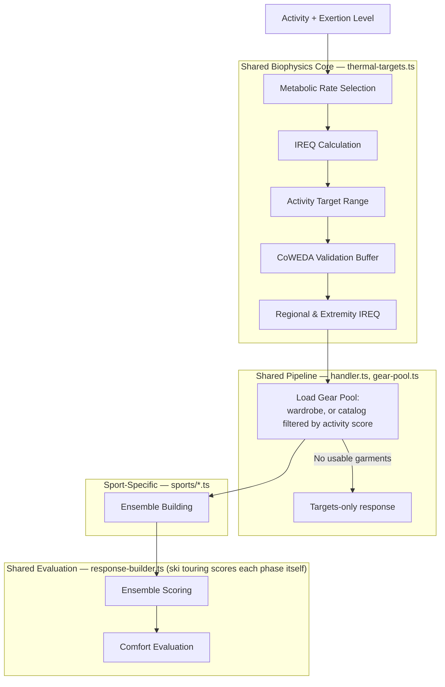
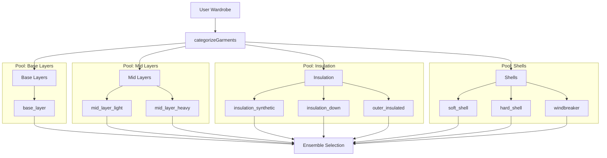
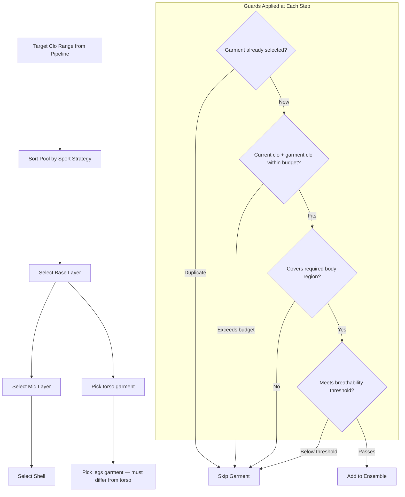
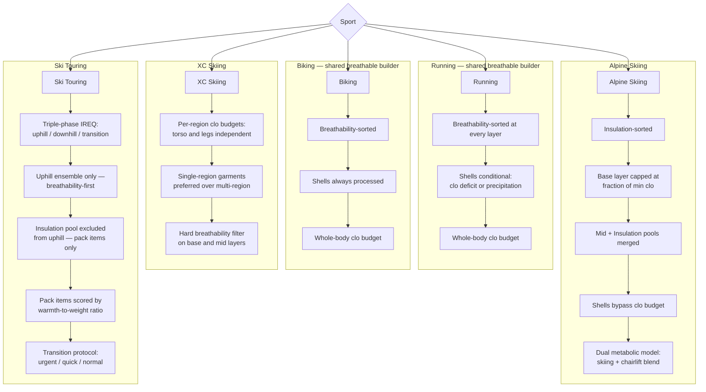
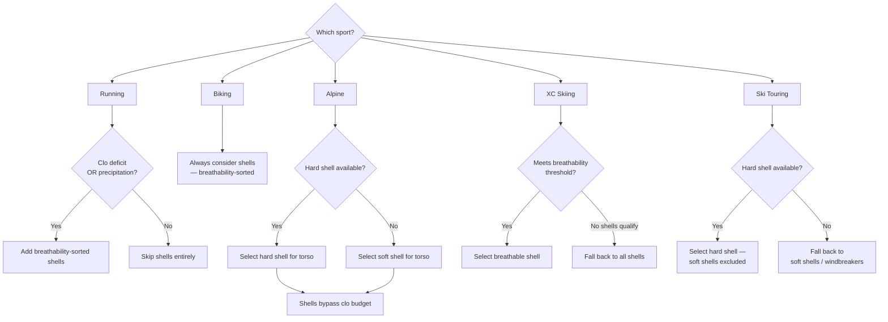

# SWTTR

SWTTR helps you pick the right layers for outdoor activities based on conditions. It blends biophysics-based insulation targets with a gear-aware wardrobe so recommendations are grounded in real clo values.

## Highlights

- **Biophysics-based recommendations** for supported winter sports using IREQ (ISO 11079)
- **Activity-based recommendations** across multiple sports and intensity profiles
- **Manual or forecast mode** for quick input or location/time-based planning
- **Wardrobe management** with calibrated gear data (clo, breathability, wind/water protection)
- **Body-part guidance** (torso, legs, hands, head/neck) with target clo insights
- **Plan ahead** with multi-day forecasts and a packing list
- **Trips** for crews: stops, per-day kits, shared group gear, and an auto-generated pack list
- **Paid agent API** for machine callers, metered per request over HTTP 402 ([docs](docs/paid-agent-api-mpp.md))
- **Mobile-first UX**, also shipped as an iOS app via Capacitor

## Activities

- Alpine Skiing
- Backcountry Skiing
- XC Skiing
- Hiking / Snowshoeing
- Running
- Biking

**Biophysics support (signed in):** Alpine Skiing, Backcountry Skiing (ski touring), XC Skiing, Running, and Biking. Hiking / Snowshoeing and signed-out users get static recommendations from `src/data/layerRecommendations.json`, which covers Alpine, XC, and Hiking.

## How Layer Recommendations Work

The biophysics-supported activities share a common recommendation pipeline built on the IREQ standard (ISO 11079). The diagrams below describe the architecture for contributors. All calculations live server-side:

- `src/lib/biophysics/` — the thermal models (IREQ, target ranges, CoWEDA buffer, ensemble prediction, scoring)
- `src/lib/recommendations/` — the shared pipeline: request parsing, `thermal-targets.ts`, gear-pool loading, and the route factory in `handler.ts`
- `src/lib/recommendations/sports/` — one module per sport with its ensemble builder, extremity rules, and response shape
- `src/app/api/v1/recommendations/<sport>/route.ts` — one-line routes that pair the factory with a sport module (the paid `/api/agent/recommendations/*` routes reuse them)

Golden tests in `src/app/api/v1/recommendations/golden.test.ts` pin every sport's full response against a snapshot of the real gear catalog; an intended output change shows up as a snapshot diff to review and update with `npx vitest run -u`.

### 1. Recommendation Pipeline

Every biophysics recommendation passes through the same pipeline, from metabolic rate lookup through final comfort classification. Multi-phase sports run the target steps once per phase: alpine blends a skiing and a chairlift phase, and ski touring computes uphill, downhill, and transition phases.



### 2. Garment Categorization and Pool Structure

Before ensemble building begins, all wardrobe garments are split into four mutually exclusive pools based on their category. Each garment belongs to exactly one pool.



### 3. Ensemble Building Flow

Garments are selected in a fixed order: base layers first, then mid layers, then shells. A running clo budget prevents over-insulation, and duplicate prevention ensures no garment appears twice.



### 4. Sport Ensemble Variants

While all sports follow the same general selection order, each has architectural differences in sorting strategy, budget model, and layer handling.



### 5. Shell Exclusion Rules

Shell selection varies significantly by sport. This decision tree shows when and which shells are considered.



### 6. Extremity Selection

Extremity recommendations handle headwear, handwear, and neck warmth with distinct selection logic and sport-dependent context.


## Getting Started

### Prerequisites

- Node.js 22 (CI's version; Next.js 16 needs 20.9 or newer)
- npm

### Install

```bash
npm install
```

### Environment Variables

Create a `.env.local` file:

```bash
# Clerk authentication
NEXT_PUBLIC_CLERK_PUBLISHABLE_KEY=pk_...
CLERK_SECRET_KEY=sk_...

# Supabase: persistent wardrobe, preferences, trips, and calibrated gear data.
# The service-role key is server-only (never prefix it with NEXT_PUBLIC_).
NEXT_PUBLIC_SUPABASE_URL=https://<project-ref>.supabase.co
SUPABASE_SERVICE_ROLE_KEY=your_service_role_or_secret_key

# Paid agent API (optional; /api/agent/* returns 503 without it).
# See docs/paid-agent-api-mpp.md.
MPP_SECRET_KEY=...
```

Without Supabase configured, database-backed API routes return 503 and the home page falls back to static layer recommendations from `src/data/layerRecommendations.json`.

### Development

```bash
npm run dev
```

Open `http://localhost:3000` in your browser.

### Build

```bash
npm run build
```

### Checks

CI runs these on every pull request (production builds come from Vercel):

```bash
npm run lint        # ESLint, zero warnings allowed
npm run typecheck   # next typegen + tsc
npm run knip        # unused files, exports, and dependencies
npm test -- --run   # Vitest
```

## Testing

This project uses Vitest with React Testing Library.

```bash
# Run all tests (watch mode by default in dev)
npm test

# Run tests with UI
npm run test:ui

# Run tests with coverage
npm run test:coverage
```

Route tests use `src/test/fakeSupabase.ts`, an in-memory stand-in for the Supabase query builder. The recommendation golden tests run against `src/test/fixtures/gear-catalog.json`, a snapshot of the real gear catalog.

## Project Structure

```
src/
  app/
    api/
      agent/recommendations/  # Paid (MPP) mirrors of the v1 recommendation routes
      v1/recommendations/     # One route per sport, built from lib/recommendations
      v1/ensembles/evaluate/  # Evaluates edited layers against the targets
      v1/trips/               # Trips, stops, crew, days, kits, group gear, pack list
      wardrobe/               # Wardrobe items, catalog, custom items
      preferences/            # User preferences
      weather/, geocode/      # Open-Meteo forecast and location search
      plan-ahead/             # Multi-day forecast plan
      packing-list/           # Packing list for a plan
      media/                  # Brand logos and item images
    trips/                    # Trips pages
    wardrobe/                 # My Gear page
    faq/                      # FAQ page
    page.tsx                  # Home: pick an activity and Gear Up
  components/
    layers/                   # Recommendation view: weather header, gauges, body-part sections, layer picker
    trips/                    # Trip UI primitives
    wardrobe/                 # Wardrobe components
    ui/                       # shadcn/ui components (vendored)
    LayerDisplay.tsx          # Recommendation view
  data/
    activities.ts             # Activity definitions
    layerRecommendations.json # Static layers for signed-out users
  hooks/                      # Client hooks: useGearUp, usePreferences, useWardrobe, useTrip, ...
  lib/
    api.ts                    # Route helpers: requireUser, readJson, jsonError
    biophysics/               # Thermal models: IREQ, targets, CoWEDA buffer, ensembles, scoring
    recommendations/          # Recommendation pipeline, sport modules, layer evaluation
    payments/mpp.ts           # Paid agent API (MPP)
    supabase.ts               # Server-only service-role client
    trips.ts                  # Trip data access and requireTripAccess
  test/                       # Supabase fake and test fixtures
  types/                      # API contracts shared by server and client, and domain types
  proxy.ts                    # Clerk middleware (Next 16's name for middleware.ts)
```

## Database (Supabase)

The app uses a biophysics-based garment database with calibrated thermal properties. See `supabase/migrations/` for the full schema. Key tables:

- `garments` - Clothing items with brand, model, category, and body coverage
- `garment_thermal_properties` - Rcl (thermal resistance) and Recl (evaporative resistance)
- `garment_protection` - Wind and water resistance ratings
- `garment_activity_ratings` - Activity-specific suitability scores
- `handwear` / `headwear` - Extremity items with thermal properties
- `user_wardrobe` - Links users to their owned gear
- `user_custom_items`, `user_item_mappings`, `user_preferences` - Per-user data
- `trips`, `trip_stops`, `trip_members`, `trip_days`, `trip_member_day_kits`, `trip_group_gear` - Trips/crew planning

**Access model:** the browser never talks to Supabase. API routes use the service-role key (`src/lib/supabase.ts`, guarded by `server-only`) and enforce per-user access in code, for example with `requireUser()` in `src/lib/api.ts` and `requireTripAccess()` in `src/lib/trips.ts`. Migration `014_restrict_to_service_role.sql` revokes all table access from the public `anon`/`authenticated` roles, so the anon key grants nothing.

**Applying migrations:** production's migration history doesn't match the numbered files here (some migrations were applied by hand), so don't `supabase db push` the whole folder. Apply new migrations individually, for example in the SQL editor or with the Supabase MCP `apply_migration`.

## Deployment

The app is hosted at `swttr.vercel.app`.

Deploy your own instance with Vercel:

[](https://vercel.com/new/clone?repository-url=https://github.com/yourusername/swttr)
