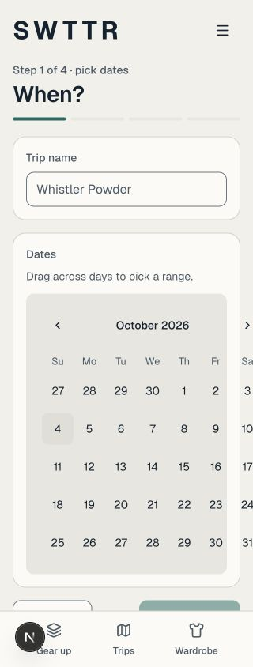

# Calendar follow-up — #119

Checked October 4, 2026, on `main` after PR #238 (`2145e4a`). The earlier integrated report covered trip lists and detail pages, but did not include the legacy date editor used when reopening an existing wizard trip at `/trips/new?trip=…&step=1`.

## Result

At 320 × 844, nested card, well and calendar padding made the 304px calendar extend to x=345: the last column and next-month arrow were clipped, and the document was 345px wide. The date card now gives the calendar its own unpadded row. It measures 280px, ends at x=300 and leaves the document at 320px wide. Labels and the date summary keep their padding; the summary and action row can wrap. The instructions now describe selecting the first and last day, matching the picker behavior.

Month arrows now measure 44 × 44px on mobile. The legacy wizard's primary action uses the existing 48px Button size (previously 44px).

| Before, 320px | After, light | After, dark |
|---|---|---|
|  |  |  |

Additional captures: [light 390px](after-light-390.jpg), [dark 390px](after-dark-390.jpg), [light desktop](after-light-1280.jpg), [dark desktop](after-dark-1280.jpg).

## Rendered checks

The real `LegacyTripWizard` was temporarily rendered at the existing local development `/design` route, without changing auth middleware or identity. Its existing dev/preview guard remained in place. We supplied a synthetic name and selected October 8–9 in component state. The create/save action was never submitted; no trip or database data was changed. The route was restored before automated checks and build.

Both palettes were explicitly pinned on the fixture's canvas. These checks verify component appearance; the system-media behavior remains covered by the [earlier appearance report](../119-system-appearance/README.md).

- At 320, 390 and 1280px in both palettes: no horizontal overflow, 48px primary action, and zero recorded text-contrast failures across 55 measured text elements per view. The audit composites CSS background colors through the rendered ancestors; hidden and disabled content is excluded. Raw measurements are in [rendered-checks.json](rendered-checks.json).
- Calendar month glyph contrast against the actual card: 15.51:1 light, 13.62:1 dark.
- Arrow Right moved from October 8 to October 9; Enter selected the range. The summary showed October 8–9 and two days, and the primary action became enabled after entering a name.
- Keyboard focus retained a 2px outline with a 2px offset. Contrast against the surrounding card: 5.64:1 light, 7.70:1 dark.
- Gear up's real single-date popover at 320px: 304px wide, entirely within x=8–312, both arrows 44 × 44px, and no document overflow. Next/Previous month moved to November and back to October.

## Automated checks

- `npm run lint` — passed.
- `npm run typecheck` — passed.
- `NODE_OPTIONS=--no-experimental-webstorage npx vitest run src/components/trips/LegacyTripWizard.test.tsx src/components/GearUpForm.test.tsx src/components/layers/WeatherEditDrawer.test.tsx src/assets/styles/globals.test.ts` — four files, 65 tests passed.
- `npm run build` — passed.

## Remaining coverage and exception

Calendar day cells remain the documented 40 × 40px exception so seven columns fit a 320px screen. This does not meet #119's universal 44px mobile target criterion as written. Month arrows meet 44px. Other mobile controls and a product decision on the calendar exception remain part of the broader acceptance review.

These checks do not verify real Clerk sessions, Supabase RLS or a native iPhone. A signed-in release walkthrough, Xcode compile, VoiceOver, outdoor readability, virtual-keyboard behavior and real safe-area checks remain outstanding. `xcode-select -p` still points to Command Line Tools; `xcrun --find xcodebuild` remains unavailable.
