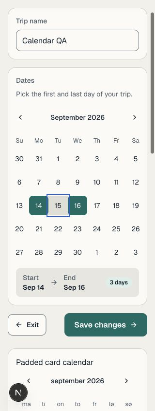
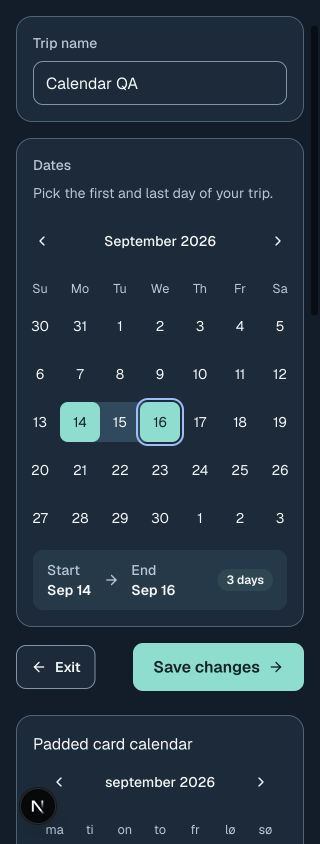

# Calendar follow-up — #119

Checked October 4, 2026. The original pass used `main` after PR #238 (`2145e4a`); the review follow-up used PR #240 after its main merge (`e78f6b5`). The earlier integrated report covered trip lists and detail pages, but not the legacy date editor at `/trips/new?trip=…&step=1`.

## Result after review

The shared Calendar now caps its width to its container and divides the available grid width into equal columns. Day cells keep their height while shrinking horizontally. Mobile padding is smaller, and a container query moves the caption below the navigation arrows when a month is narrower than 12rem. Padded cards, drawers and sheets can use the component without a caller-specific padding rule. The grid uses DayPicker 9.13's `month_grid` class key; fixed table layout and shrinkable weekday/week-number columns also prevent intrinsic table width from overflowing at enlarged text sizes.

A completed multi-day range starts over on the next chosen day. Reopening a saved trip, or returning from step 2, opens the saved start month. Start, arrow and End stay in one group while the duration badge can wrap. The date step alone selects the 48px primary Button size; other wizard steps and the standalone stops editor retain their default size. Saving uses Button's `loading` behavior to keep keyboard focus and ignore repeated activation.

| Reviewed, light 320px | Reviewed, dark 320px |
|---|---|
|  |  |

Additional captures: [150% text](review-large-text-320.jpg), [padded drawer at 150% text](review-drawer-large-320.jpg), [padded sheet at 150% text](review-sheet-large-320.jpg).

## Review follow-up checks

Real `Step1Dates`, shared Calendar and `TripStopsEditor` components were temporarily rendered at the existing local development `/design` route. The dev/preview guard, auth middleware and identity were unchanged. The fixture supplied a synthetic September 10–12 trip, component state and no-op submit callbacks. No trip or database data was changed. Temporary source and the Step1Dates export were removed before automated checks and build.

Both palettes were pinned on the fixture canvas. The 150% text check changed only the fixture's root font size from 16px to 24px. This verifies rem scaling, not native Dynamic Type or browser zoom. The system-media behavior remains covered by the [earlier appearance report](../119-system-appearance/README.md).

- At 320, 390 and 1280px in both palettes: document width equals viewport width and all three inline calendars have matching client/scroll widths. The views include a normally padded Card, a Danish month caption and two months with week numbers. There are zero recorded text-contrast failures across 203 measured text elements per normal view.
- At 320px: the date-step calendar is 280px wide, the padded Card calendar is 254px wide, and month arrows are 44 × 44px. The date-step primary action is 48px; standalone stops Back and Done are both 44px.
- At 150% text and 320px: the editor calendar is 270px wide; padded Card and week-number calendars are 222px wide, without internal or document overflow. The date pair remains together and only the badge wraps. The padded drawer calendar is 222px wide and the sheet calendar is 191px wide, both without internal overflow. Escape closes each overlay and restores focus to its trigger.
- Selecting September 14 resets the saved September 10–12 range to one day. Two Arrow Right presses and Enter complete September 14–16; the summary shows three days. Normal-size keyboard focus has a 2px outline and 2px offset, with contrast 5.64:1 light and 7.70:1 dark.
- Raw measurements are in [review-checks.json](review-checks.json). The audit composites computed RGB and Oklab colors and ancestor opacity; hidden and disabled text is excluded. Measurements outside the viewport still check layout/text styles, not visibility through scrolling.

## Original clipping regression

At 320 × 844, nested card, well and calendar padding made the original 304px calendar extend to x=345: the last column and next-month arrow were clipped, and the document was 345px wide. The date card now gives the calendar its own unpadded row, with separately padded labels and summary. The shared fix above also handles callers that retain padding.

| Before, 320px | Original fix, light | Original fix, dark |
|---|---|---|
|  |  |  |

The original pass checked 320, 390 and 1280px in both palettes, and Gear up's real single-date popover at 320px (304px wide within x=8–312, 44px arrows, Next/Previous month navigation). Historical measurements are in [rendered-checks.json](rendered-checks.json); captures are [light 390px](after-light-390.jpg), [dark 390px](after-dark-390.jpg), [light desktop](after-light-1280.jpg) and [dark desktop](after-dark-1280.jpg).

## Automated checks

The focused suite covers the date wizard, standalone stops page, Gear up, weather drawer, Button and global styles. Date regressions assert the actual initial and lodging-confirmation PATCH payloads for replacing 10–12 with 14–16, saved-month navigation on reopen and Back, and focus/duplicate-request behavior during and after a failed save.

- `npm run lint` — passed.
- `npm run typecheck` — passed.
- `NODE_OPTIONS=--no-experimental-webstorage npx vitest run src/components/trips/LegacyTripWizard.test.tsx src/components/GearUpForm.test.tsx src/components/layers/WeatherEditDrawer.test.tsx src/assets/styles/globals.test.ts src/components/ui/button.test.tsx 'src/app/trips/[id]/stops/page.test.tsx'` — six files, 76 tests passed.
- `npm run build` — passed.

## Remaining coverage and exception

Calendar days remain up to 40px wide and 40px high on phones and touch, with narrower columns in padded containers. This does not meet #119's universal 44px mobile target criterion as written. Month arrows meet 44px. Other mobile controls and a product decision on this exception remain part of the broader acceptance review.

These checks do not verify real Clerk sessions, Supabase RLS or a native iPhone. A signed-in release walkthrough, Xcode compile, VoiceOver, outdoor readability, virtual-keyboard behavior and real safe-area checks remain outstanding. `xcode-select -p` points to Command Line Tools; `xcrun --find xcodebuild` is unavailable.
