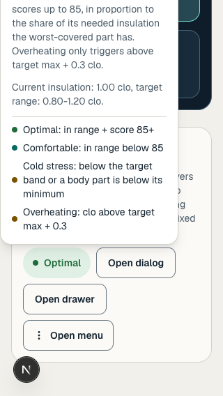
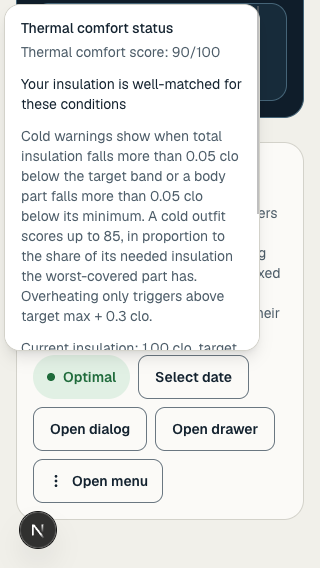
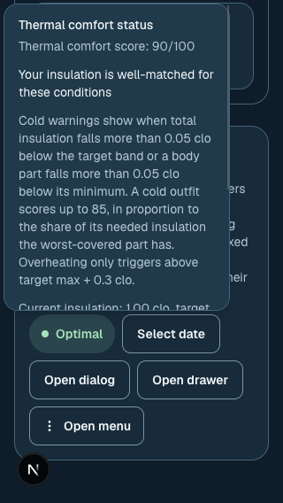

# Popover viewport verification — #119

Checked October 4, 2026, against `c7a8d7d` on main. The shared popover had no height constraint. At 320 × 568, the real `ScoreDisplay` explanation was 573px tall, began at −222px and could not scroll internally. Its title and first paragraphs were outside the screen.

The shared primitive now uses [Radix’s available-space variables](https://www.radix-ui.com/primitives/docs/components/popover#constrain-the-content-size) to cap its width and height, with scrolling and a 4px collision gutter. The gutter leaves space for the focus outline while retaining the default calendar’s 306px width on a 320px screen. `/design` now includes the actual thermal explanation and a selectable calendar so future changes can be checked without an account.

| Before, light | After, light | After, dark |
|---|---|---|
|  |  |  |

The after screenshots show the top of the scrollable content. Keyboard End reached its last paragraph; the raw measurements record that paragraph fully inside the popover.

## Rendered checks

An isolated headless Chrome profile, a local Next.js dev server and real `prefers-color-scheme` emulation. The reference route was temporarily excluded from Clerk middleware for these signed-out component measurements because the local authentication request stalled. The original proxy was restored before the production build; no authentication change is part of this patch. No account data or database writes were used.

At 320 × 568, 390 × 844 and 1280 × 900, in both appearances:

- Thermal explanation and calendar bounds remain inside the viewport. Neither overlay nor the page has horizontal overflow.
- At 320px, the thermal popover is 347px high, starting at 4px. End scrolls it by 226px and reveals the last paragraph. Scrolling beyond the end does not scroll the page behind it.
- Escape closes each popover and restores focus to its trigger.
- Calendar Arrow Down and Enter select a date; its selected accessible label updates. Next-month navigation works.
- The selected calendar day retains a 2px focus outline with a 2px offset. Its outline contrast against the surrounding rendered surface is 4.36:1 in light and 4.96:1 in dark.
- The rendered text audit checks nine thermal text elements and 43 calendar text elements per view, compositing text opacity and ancestor backgrounds. There are no failures; minimum measured text contrast is 7.02:1 in light and 6.91:1 in dark. These components have solid backgrounds. This is component coverage, not an app-wide accessibility certification.

[Raw results](rendered-checks.json).

## Automated checks

- `npm run lint` — passed.
- `npm run typecheck` — passed.
- `npm run build` — passed with the original authentication proxy.
- `NODE_OPTIONS=--no-experimental-webstorage npx vitest run src/assets/styles/globals.test.ts src/components/GearUpForm.test.tsx src/components/layers/WeatherEditDrawer.test.tsx src/components/layers/ResultHeader.test.tsx` — four files, 61 tests passed.

## Remaining release coverage

This patch does not complete #119’s integrated signed-in or real iPhone/Capacitor checks. VoiceOver, outdoor readability, real safe areas and virtual-keyboard behavior remain unverified. Calendar day sizes remain the existing documented exception; PR #240 handles calendar layout and month-arrow sizing separately.
