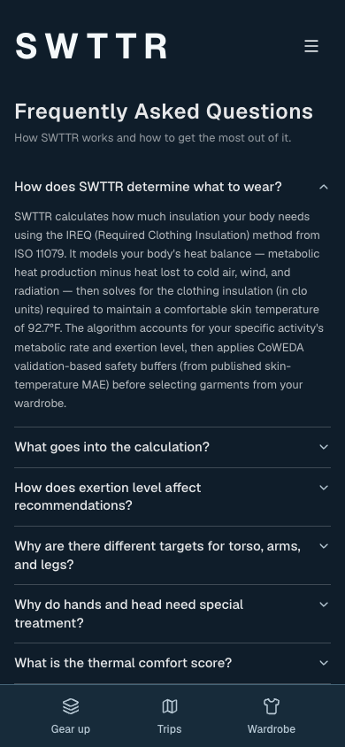
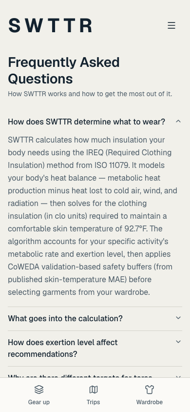
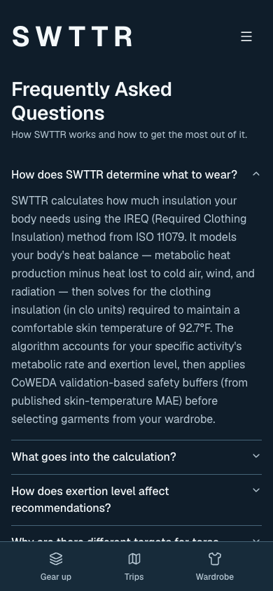

# System appearance verification — #119

Checked October 4, 2026, against the Trips migration on `origin/main` (`53f6ce9`). This follow-up moves FAQ to the shared tokens and removes the app-wide dark pin. Screenshots use the same local development configuration, signed out, with no account data or database changes.

## Before and after

At 390 × 844, with the first FAQ answer open. Before, a light device still received the dark palette. After, CSS follows the system appearance.

| Before | System light | System dark |
|---|---|---|
|  |  |  |

Additional views: [light FAQ at 320px](after-light-faq-320.png), [dark FAQ at 1280px](after-dark-faq-1280.png), and Settings at 320 × 568 in [light](compact-light-settings-320.png) and [dark](compact-dark-settings-320.png).

## Rendered checks

Headless Chrome, controlled through the DevTools protocol, with actual `prefers-color-scheme` emulation rather than setting `data-appearance` on the root. Main checks used 320 × 844, 390 × 844 and 1280 × 900 in both palettes; short-screen drawer checks used 320 × 568.

- FAQ, Gear up, Settings and the mobile menu: no horizontal overflow in either palette.
- FAQ: Enter closes the open answer; Arrow Down moves to the next question; Tab navigation shows a 2px focus outline with a 2px offset. Every question trigger is at least 44 × 44px.
- Settings: 18 consecutive Tab presses stay inside the drawer. Escape closes it and restores focus to Settings on desktop or Open menu on mobile.
- Short-screen Settings: the drawer stays within the viewport, its body scrolls to the bottom, and focus containment/restoration still pass. This is a short viewport check, not an iOS virtual-keyboard test.
- Production FAQ also rendered the correct light and dark canvas with JavaScript disabled, confirming CSS appearance works before hydration.
- System setting changed from light to dark while FAQ stayed open: canvas became `rgb(15, 29, 42)` without a reload; the root had no appearance pin.
- Exactly one viewport meta tag remains, with `width=device-width, initial-scale=1, viewport-fit=cover`. Both theme-color tags match their palettes and media queries. Zoom is unrestricted.
- Rendered text contrast: zero failures or unmeasured image/gradient backgrounds across these checks. The audit composites computed text opacity over ancestor backgrounds and applies 4.5:1 for ordinary text and 3:1 for large text. Hidden/modal-obscured content and disabled controls are excluded. It checks 24–29 text nodes per FAQ/Gear up view, 23 per Settings view and six per mobile menu.
- The existing token tests check text pairs, control outlines, selection marks and focus rings in both palettes. Rendered FAQ focus colors are `rgb(31, 95, 204)` in light and `rgb(150, 190, 255)` in dark.

The raw results are in [rendered-checks.json](rendered-checks.json).

## Automated checks

- `npm run lint` — passed.
- `npm run typecheck` — passed.
- `NODE_OPTIONS=--no-experimental-webstorage npx vitest run` — 94 files, 1,169 tests passed. Node 26 needs this flag because its native localStorage otherwise shadows jsdom's.
- `npm run build` — passed.
- `xcrun swiftc -frontend -parse ios/App/App/SWTTRViewController.swift` — passed (syntax only). `xcode-select -p` points to Command Line Tools and `xcrun --find xcodebuild` fails, so an iOS compile was unavailable.

## Remaining release coverage

This follow-up did not repeat authenticated Trips, Wardrobe or personalized-result visual checks. Their migrations were checked separately; see PRs [#237](https://github.com/derobertsw/swttr/pull/237), [#216](https://github.com/derobertsw/swttr/pull/216), [#219](https://github.com/derobertsw/swttr/pull/219) and [#228](https://github.com/derobertsw/swttr/pull/228). Those reports do not substitute for an integrated signed-in release walkthrough.

Real iPhone/Capacitor checks, VoiceOver, outdoor readability, virtual-keyboard behavior and real safe-area insets remain unverified. Chrome mobile emulation cannot verify them. The custom UIKit shell now requests the system status-text style and uses dynamic loading canvas colors, but these Swift changes need an Xcode build and device verification. It retains its fixed dark tab bar and action button, and it does not initialize the Capacitor status-bar plugin. This exception is recorded in [the design-system guide](../../design-system.md) and belongs to the native work in #130/#146. No native appearance claim is based on the mocked Capacitor unit test.
