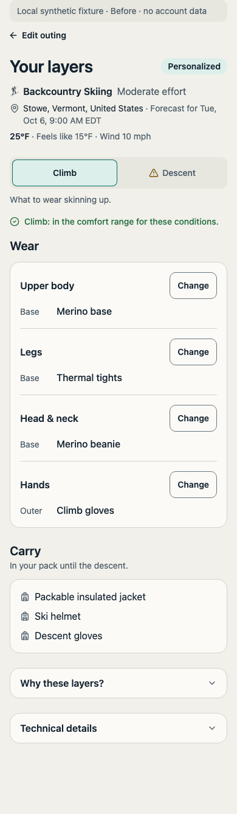
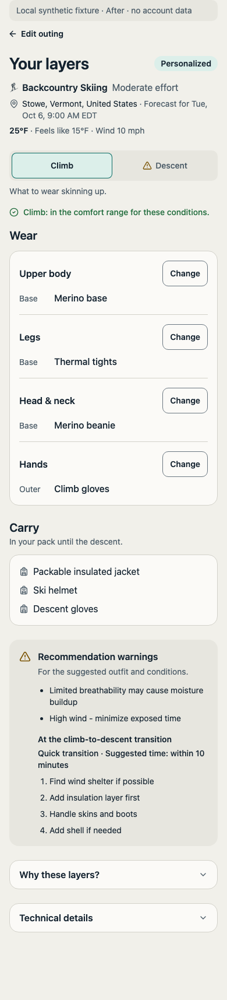
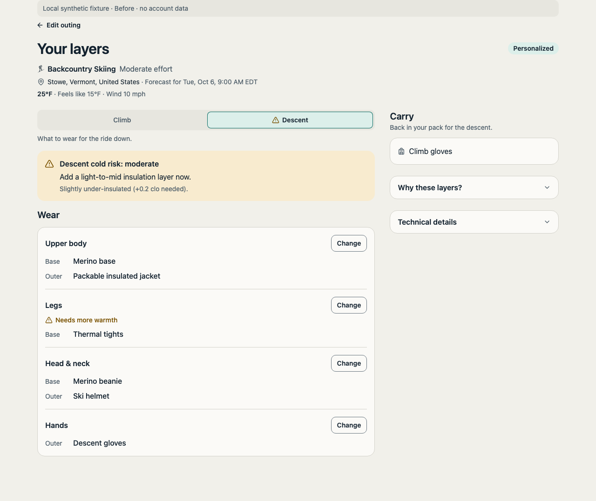
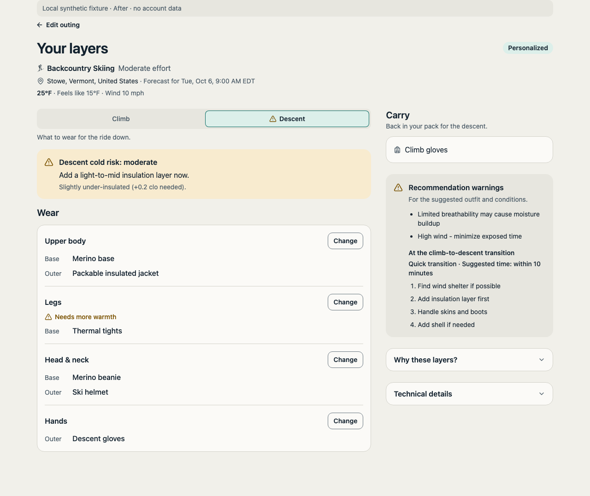

# Result acceptance follow-up — #127

Checked October 6, 2026, against `origin/main` (`f896fe3`). The outfit-first redesign is already present from PRs #198, #204, #219, #223 and #228. This follow-up fixes gaps found when reconciling the remaining acceptance criteria with current source.

## Changes

- Recommendation warnings were returned by the server but never rendered. They now appear outside the collapsed explanation and technical details, together with the server's backcountry transition warnings, ordered steps, priority and suggested timing. Duplicate warnings appear once. The combined warning list applies to the original recommendation; the API does not attribute every warning to a particular phase.
- The backcountry picker ranked descent options using climb targets and disabled any item worn in either phase. It now uses the phase being edited for both target ranking and duplicate prevention. The drawer names Climb or Descent. An item worn in the other phase remains available, and choosing it updates only the intended phase and its carry list.
- Original recommendation properties are explicitly labeled in Technical details, including that they describe the climb outfit for backcountry. After an edit, the original warnings and properties identify their scope. Edited-outfit comfort evaluation does not check breathability, weather protection or transition needs.
- At 320px with text enlarged to 200%, body-area labels and Change controls wrap onto separate lines when needed. Clothing names and warning text can wrap within the available width.
- The packing list's contextual Sign in action uses the existing outing-return path from #168 and has a 44px minimum height. It returns to the saved outing instead of sending the user to an unrelated default screen.

No thermal thresholds, server outfit selection, API payloads, ownership mutations or persistence behavior changed.

## Before and after

The real components were rendered with synthetic wardrobe, catalog, weather and recommendation fixtures. The same fixture was used for the baseline and updated view. The baseline LayerDisplay came from `origin/main`; shared primitives came from the current checkout. The preview used Vite with Clerk and Next navigation adapters; it did not run a real signed-in session. The synthetic evaluation responder uses the same function as the server route. All other writes are rejected. The preview and adapters live outside the repository.

| 390px climb before | 390px climb after |
|---|---|
|  |  |

| Desktop descent before | Desktop descent after |
|---|---|
|  |  |

Additional captures include [mobile descent](after-descent-light-390.png), [dark climb](after-climb-dark-390.png), [dark descent](after-descent-dark-390.png), [the descent picker](after-descent-picker-light-390.png), [an edited descent](after-descent-edit-light-390.png) and [320px with 200% text](after-climb-large-text-320.png).

## Acceptance evidence

| Criterion | Evidence |
|---|---|
| Full-width outfit before instrumentation, with place, time and guide type | Rendered Climb and Descent at 320px, 390px and 1280px in both palettes. Clothing appears before the collapsed numerical details. |
| Read-only general guidance and distinct recoverable states | Existing LayerDisplay tests, plus rendered [general guide with rain](fixture-general-guest.png), [no usable gear](fixture-no-gear.png), [recommendation failure](fixture-error.png) and [unsupported advice](fixture-unsupported.png). |
| Edits, failed checks, retry and undo | Existing LayerDisplay tests retain the changed outfit and label the previous check. [Failed initial evaluation](fixture-touring-evaluation-error.png) offers retry without inventing a verdict. Original warnings remain visible even when evaluation fails. |
| One phase selection changes summary, rows, picker and carry together | Real-hook/real-drawer tests in `LayerDisplay.phases.test.tsx` verify phase targets, other-phase item availability, same-phase duplicate blocking, carry changes and isolated undo. Rendered checks cover phase switching and a descent edit. |
| Ownership changes only through an explicit action | Existing tests cover “I own this” success/failure and accurately labeled search. The real-picker phase test verifies that choosing a garment does not issue a wardrobe mutation. |
| Important warnings remain outside Technical details | New LayerDisplay tests cover warning visibility, deduplication, transition steps/timing and warning scope after editing and undo. Body-area warmth gaps still come from server evaluation; empty optional slots remain behind Change. |
| Partial coverage precedes packing; failure is actionable | Existing MultiDayPlanDisplay tests remain intact. Rendered [partial-plan packing](fixture-plan.png) and [packing failure](fixture-plan-packing-error.png) retain the coverage warning above packing content. |

Raw rendered measurements are in [rendered-checks.json](rendered-checks.json). The captures demonstrate fixture behavior, not real weather or the accuracy of the thermal model.

No horizontal overflow was recorded. Mobile result controls meet the 44px product target. Desktop fine-pointer controls retain the shared 36px sizing. In the real picker at 320px, eight consecutive Tab presses stayed inside the dialog; Escape closed it and restored focus to Add mid. The partial plan's Packing tab was activated with Enter, and the failed fixture displayed Packing list unavailable with Try again below its coverage notice.

## Automated checks

- Lint, typecheck and unused-code checks passed.
- The full suite after integrating current main passed: 102 files, 1,280 tests, including unchanged recommendation golden tests. The run used two workers and a 60-second timeout because a concurrent file-sync load caused timeouts in an earlier attempt; no assertions were removed or weakened.
- Production build passed. The initial dependency symlink was replaced with a local copy because Turbopack rejects symlinks outside its filesystem root.
- After the final layout/account-link adjustment, the focused result, packing, outing-return and editable-layer checks passed again: six files, 136 tests. Lint, typecheck and production build were repeated on the final source.

## Remaining integrated release checks

Real-account Clerk/Supabase behavior, iPhone/Capacitor, VoiceOver, native safe areas, the software keyboard and outdoor readability remain unverified here. These belong to the integrated validation in #130. This evidence does not close those checks or claim that #127 has completed its device acceptance.
