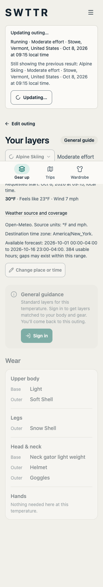
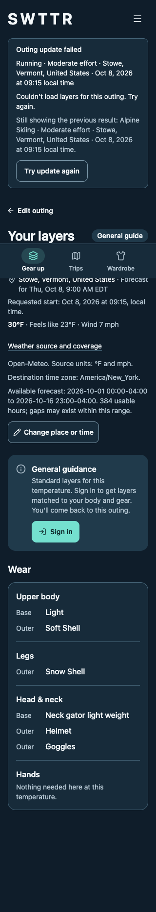

# #166 outing contract acceptance — October 5, 2026

This report completes the contract acceptance review after #215 (foundation) and #241 (restoring changed outings). The current implementation keeps pending/failed request context separate from displayed advice and carries available weather provenance through both result adapters. See [the contract and acceptance mapping](../../outing-contract.md).

## Automated verification

- Full Vitest suite: final result recorded below after verification. Recommendation golden snapshots are unchanged.
- Additional focused coverage includes failed-outing retry, retained recommendation identity, old failures arriving during a newer request, weather/recommendation retirement, malformed current/forecast responses, unknown precipitation, provider timestamps, local coverage and missing metadata.
- Existing tests retain coverage for auth expiry, account changes, targets-only/no usable gear, static/unsupported guidance, exact requested minutes, destination/device time-zone differences, daylight saving, partial forecasts, Edit outing, Start over, Back/reload and the native Plan compatibility event.
- Lint, typecheck and knip pass.
- `npx next build --webpack` passes as a production build. The repository's `npm run build` (Turbopack) cannot complete in this host sandbox: its CSS worker attempts to bind a helper port and receives `Operation not permitted`. This is recorded as an environment limitation, not a successful Turbopack check. No bundler configuration was changed.
- Node 26 requires `NODE_OPTIONS=--no-experimental-webstorage` for jsdom's storage; CI uses Node 22.

## Browser verification

[Raw checks](browser-checks.json) record 22 assertions against the actual Home page, hooks and components in isolated headless Chrome. A temporary Vite harness substitutes Next navigation/link plumbing and a guest Clerk identity, and intercepts API requests with synthetic Stowe weather and recommendation responses. Production application code and auth middleware were not bypassed or patched. This tests rendered behavior with fixtures, not real Clerk sessions, Supabase permissions or a real forecast service. No account or database records were changed.

The flow starts from a tab draft for Alpine in Stowe on October 8 at 09:15, showing the API's 09:00 forecast separately. Switching to Running holds the response, then returns 503. The old Alpine result remains under its original context and the pending/failed notice names Running. Keyboard retry requests Running once; its guest sign-in outcome replaces the result, clears the error and moves focus into the result. Edit outing preserves Running and 09:15.

- Pending and failed states fit 320 × 568, 390 × 844 and 1280 × 900 in system light/dark, with no horizontal page overflow at ordinary text size.
- The source disclosure displays source units, destination zone and available-hour bounds/count. It is optional and keyboard operable using the native disclosure.
- The failure notice and retry control wrap at 200% root text size; the retry button retains focus while busy and restores focus on success.
- No browser runtime errors occurred.

| Pending, light | Failed, dark |
|---|---|
|  |  |

Also captured: [pending dark](pending-dark-320.png), [failed light](failed-light-320.png), and [200% text](large-text-320.png). Screenshots are full-page captures: the fixed mobile navigation is drawn at the bottom of the viewport near the top of each image, not at the end of the full document.

## #130 release coverage retained

The 200% text probe still shows page-level horizontal overflow in existing Header, activity/change-weather buttons and mobile navigation. The new notice/retry wrapping is corrected; those broader shared-control and shell constraints remain #130 accessibility acceptance work. This report does not claim full 200% page conformance.

Real-account sign-in, native iPhone/Capacitor, VoiceOver, outdoor readability, actual safe areas/virtual keyboard and participant testing remain with #130/#168. The native event tests are jsdom compatibility checks. #185 still owns the awaitable tool action, abort signals, structured caller outcomes and edited-result readback; those are not required to consume this shared UI contract.
